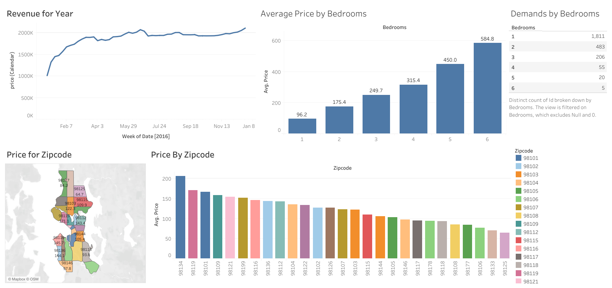

# Airbnb Data Dashboard Project

## Overview

This Tableau dashboard project analyzes Airbnb listings data to provide insights into key metrics such as pricing, availability, and location trends. The dashboard is designed to help users explore Airbnb market dynamics, identify patterns, and make data-driven decisions.

## Dataset

- **Source:** Airbnb dataset containing listing details, prices, availability, and reviews.
- **Data Cleaning:** The dataset was cleaned and preprocessed to handle missing values, outliers, and inconsistent entries to ensure accuracy in analysis.
- **Scope:** The dataset focuses on listings from [specify city/region if applicable].

## Project Structure

- **Logical Table:** A clean, structured table in Tableau consolidating relevant fields for visualization.
- **Sheets:** Five individual sheets providing different visual perspectives (e.g., price distribution, listing types, availability trends).
- **Dashboard:** A combined interactive dashboard that integrates all sheets for holistic data exploration.

  

## Features

- Interactive filters for selecting date ranges, property types, and neighborhoods.
- Visual representations including bar charts, maps, and trend lines.
- Tooltips for additional context on data points.
- User-friendly layout emphasizing important metrics and trends.

## How to Use

1. Open the Tableau workbook file (`AirbnbDashboard.twb` or `.twbx`) in Tableau Desktop or Tableau Public.
2. Use the filters on the dashboard to customize views according to your preferences.
3. Hover over data points for detailed information.
4. Explore individual sheets for in-depth analysis.

## Insights

- Price variation across neighborhoods.
- Availability trends over time.
- Popular property types and their distribution.
- Correlations between price and availability.

## 📁 Files Included

- `AirBnB_Proeject.xlsx`: Orginal dataset.
- `AirBnB_Project.twbx`: Tableau Project.
- `README.md`: This documentation file.

## Future Work

- Incorporate additional datasets such as user reviews or host information.
- Add predictive analytics for price forecasting.
- Enhance mobile responsiveness of the dashboard layout.

## Contact

**Manal Mosharaf**  
_Data Scientist  
📧 [mosharafmanal@gmail.com]  
🔗 [LinkedIn Profile or Portfolio Website]
